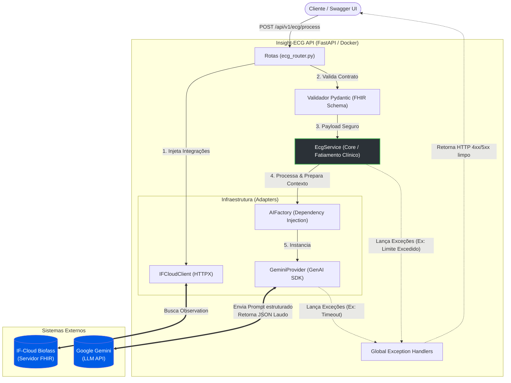

# POC: Insight-ECG API

[](https://www.python.org/)
[](https://fastapi.tiangolo.com/)
[](https://www.docker.com/)


> [!IMPORTANT]
> POC em estágio de desenvolvimento ativo e integração

## Sumario


## Visão Geral

O **Insight-ECG** é uma Prova de Conceito (POC) baseada em Inteligência Artificial projetada para atuar como a camada de inteligência do ecossistema **IF4Health**. na leitura de ecgs e sintetização 

## Fluxo do Sistema

## Arquitetura e Tecnologias

* **Framework:** [FastAPI](https://fastapi.tiangolo.com/) (Framework web assíncrono e de alta performance).
* **Validação de Dados:** [Pydantic](https://docs.pydantic.dev/) (Validação estrita de *schemas* FHIR).
* **Integração de IA:** [Google Gen AI SDK](https://pypi.org/project/google-genai/). (No momento somente o Gemini por questão de disponibilidade da chave de API)
* **Infraestrutura:** Docker & Docker Compose para um *deploy* contínuo e sem atritos.


## Estrutura de pastas
O projeto segue os princípios da **Clean Architecture**, promovendo o desacoplamento entre a regra de negócio e os serviços de infraestrutura (APIs externas, IA).
```text
├── app/
│   ├── core/           # Configurações globais, exceções customizadas e prompts de IA
│   ├── infrastructure/ # Adaptadores externos (Cliente IF-Cloud, Factory do Gemini)
│   ├── routes/         # Endpoints de entrada HTTP (FastAPI Routers)
│   ├── schemas/        # Contratos de validação estrita Pydantic (Ex: FHIRObservation)
│   ├── services/       # Coração da regra de negócio (EcgService) e fatiamento clínico
│   └── main.py         # Entrypoint da aplicação e injeção de Exception Handlers
├── tests/              # Bateria de testes unitários e de integração
├── .env.example        # Template seguro de variáveis de ambiente
├── docker-compose.yml  # Orquestração do ambiente local
├── Dockerfile          # Imagem de produção/desenvolvimento
├── pytest.ini          # Configuração de mapeamento do ambiente de testes
└── requirements.txt    # Dependências do projeto fixadas 
```

## Como Executar Localmente

Este projeto é totalmente conteinerizado. Você não precisa instalar dependências Python localmente para rodar a API.

### Pré-requisitos
* [Docker Desktop](https://www.docker.com/products/docker-desktop/) instalado e em execução.
* Integração com WSL 2 ativada (se estiver rodando no Windows).

### Subindo o Ambiente

1. Clone o repositório:
   ```bash
   git clone [https://github.com/LeonardoEnnes/poc-insight-ecg-api.git](https://github.com/LeonardoEnnes/poc-insight-ecg-api.git)
   cd poc-insight-ecg-api

2. Inicie a aplicação usando o Docker Compose:

    ```bash
    docker compose up --build
    ```

3. Variaveis de ambiente:
    - Obtendo a chave do **Gemini**: (no momento o gemini é o unico aceito no sistema)
        - Acesse o [Google AI Studio](https://aistudio.google.com/app/api-keys).
        - Clique em **Create API Key**
        - Copie o valor gerado
    - Na raiz do projeto, copie e cole no terminal:
    ```cp .env.example .env```
    - Edite o arquivo .env e cole suas credenciais
        ```bash 
        AI_API_KEY="COLE_SUA_CHAVE_AQUI" # Gemini, openai etc 
        AI_MODEL_NAME="gemini-1.5-flash" # consulte sempre os modelos disponiveis no provedor de IA que selecionar na doc oficial da LLM
        ```
 
4. Acesse a API e a documentação:

    - Health Check: http://localhost:8000/health

    - Swagger UI: http://localhost:8000/docs

### Como rodar os Testes
Com a aplicação rodando (docker compose up) em outro terminal rode:
```bash
docker exec -it poc-api pytest -v
```
### Rotas disponiveis

Exemplo de Integração: ````jsonPOST /api/v1/ecg/process````

Estrutura de Saída (JSON - HTTP 200 OK):

````json
{
  "ritmo": "Sinusal",
  "anomalias_detectadas": false,
  "descricao_tecnica": "Ciclo cardíaco regular com morfologia de onda P preservada. Intervalos PR e QT dentro dos limites fisiológicos normais.",
  "risco": "BAIXO",
  "recomendacao": "Manter monitorização clínica contínua de rotina."
}
````

## Arquitetura do Sistema

O **Insight-ECG** foi construído isolando a regra de negócio das integrações externas. A aplicação atua como um mediador inteligente, aplicando validações e técnicas de engenharia de prompt antes de consultar o modelo fundacional.



---
### Documentação Aprofundada
As decisões técnicas, padrões de projeto e justificações arquiteturais estão documentadas no diretório docs/.

- [Decisões Arquiteturais](/docs/ARQUITETURA.md)