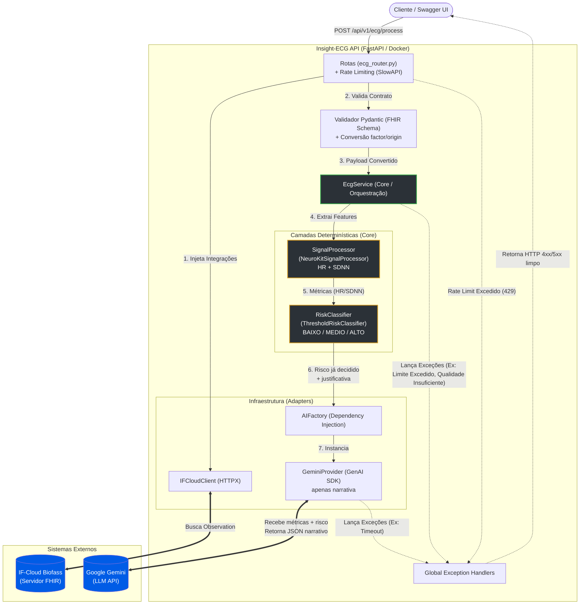

# POC: Insight-ECG API

[](https://www.python.org/)
[](https://fastapi.tiangolo.com/)
[](https://www.docker.com/)
[](https://github.com/LeonardoEnnes/poc-insight-ecg-api/actions/workflows/ci.yml)

> [!IMPORTANT]
> POC finalizada

## Sumário
- [Visão Geral](#visão-geral)
- [Fluxo do Sistema](#fluxo-do-sistema)
- [Arquitetura e Tecnologias](#arquitetura-e-tecnologias)
- [Como Executar Localmente](#como-executar-localmente)
  - [Pré-requisitos](#pré-requisitos)
  - [Subindo o Ambiente](#subindo-o-ambiente)
- [Como rodar os Testes](#como-rodar-os-testes)
- [Rotas disponiveis](#rotas-disponiveis)
- [Estrutura de pastas](#estrutura-de-pastas)
- [Arquitetura do Sistema](#arquitetura-do-sistema)
- [Documentação Aprofundada](#documentação-aprofundada)

## Visão Geral

O **Insight-ECG** é uma Prova de Conceito (POC) projetada para atuar como a camada de inteligência do ecossistema **IF4Health**, na leitura de ECGs e síntese de laudos clínicos preliminares, com classificação de risco e alertas.

O sistema combina processamento determinístico de sinal (DSP) e classificação de risco baseada em regras com um LLM, que atua exclusivamente como narrador — comunicando em linguagem clínica uma síntese já fundamentada matematicamente, nunca decidindo sozinho a interpretação do sinal ou o nível de risco.

## Fluxo do Sistema

O funcionamento do **Insight-ECG** segue um pipeline linear e resiliente:

1.  **Entrada (Ingestão)**: O sistema recebe um identificador de exame (`observation_id`) ou um payload JSON manual no padrão HL7 FHIR.
2.  **Integração e Coleta**: Caso seja uma integração, o `IFCloudClient` realiza uma chamada autenticada ao servidor do IF-Cloud para extrair os biossinais brutos.
3.  **Validação e Conversão**: O `EcgService` valida a integridade do sinal via Pydantic e aplica a conversão de unidade do sinal (`factor`/`origin` do FHIR `SampledData`).
4.  **Fatiamento Clínico**: Aplicação de um fatiamento (*sliding window*) de até 30.000 pontos, garantindo uma janela de contexto de aproximadamente 1 minuto de exame.
5.  **Extração Determinística de Features (DSP)**: O `SignalProcessor` (`NeuroKitSignalProcessor`) calcula frequência cardíaca (HR) e variabilidade RR (SDNN) a partir do sinal.
6.  **Classificação de Risco Determinística**: O `RiskClassifier` (`ThresholdRiskClassifier`) decide o nível de risco (BAIXO/MEDIO/ALTO) a partir das métricas extraídas.
7.  **Narrativa por IA (Inferência)**: As métricas e a decisão de risco são injetadas em um prompt estruturado com *guardrails* clínicos e enviadas ao Google Gemini através do `GeminiProvider`, cuja função é comunicar o resultado em linguagem clínica.
8.  **Saída (Entrega)**: O sistema devolve um laudo técnico estruturado em JSON, com o campo de risco sempre correspondente à decisão do classificador determinístico.

## Arquitetura e Tecnologias

* **Framework:** [FastAPI](https://fastapi.tiangolo.com/) (Framework web assíncrono e de alta performance).
* **Validação de Dados:** [Pydantic](https://docs.pydantic.dev/) (Validação estrita de *schemas* FHIR e de saída do LLM).
* **Processamento de Sinal:** [NeuroKit2](https://neuropsychology.github.io/NeuroKit/) (extração determinística de frequência cardíaca e variabilidade RR).
* **Integração de IA:** [Google Gen AI SDK](https://pypi.org/project/google-genai/). (No momento somente o Gemini por questão de disponibilidade da chave de API).
* **Rate Limiting:** [SlowAPI](https://github.com/laurentS/slowapi).
* **Testes de Qualidade de LLM:** [DeepEval](https://github.com/confident-ai/deepeval) (métricas de alucinação e fidelidade textual via LLM-as-judge).
* **Infraestrutura:** Docker & Docker Compose para um *deploy* contínuo e sem atritos.

> [!WARNING]
> Nomes de modelo de LLM (tanto o provedor de produção quanto o modelo usado como avaliador em `tests/quality/`) mudam com frequência e podem ser descontinuados sem aviso prévio no código. Se a API retornar erro 404 mencionando "no longer available", a própria mensagem de erro costuma indicar o modelo de substituição recomendado - consulte `AI_MODEL_NAME` no `.env` e o `model_name` em `tests/quality/gemini_judge_model.py`.

## Como Executar Localmente

Este projeto é totalmente conteinerizado. Você não precisa instalar dependências Python localmente para rodar a API.

### Pré-requisitos
* [Docker Desktop](https://www.docker.com/products/docker-desktop/) instalado e em execução.
* Integração com WSL 2 ativada (se estiver rodando no Windows).

### Subindo o Ambiente

1. Clone o repositório:
   ```bash
   git clone https://github.com/LeonardoEnnes/poc-insight-ecg-api.git
   cd poc-insight-ecg-api
   ```

2. Inicie a aplicação usando o Docker Compose:

    ```bash
    docker compose up --build
    ```

3. Variaveis de ambiente:
    - Obtendo a chave do **Gemini**: (no momento o gemini é o unico aceito no sistema)
        - Acesse o [Google AI Studio](https://aistudio.google.com/app/api-keys).
        - Clique em **Create API Key**
        - Copie o valor gerado
    - Na raiz do projeto, copie e cole no terminal:
    ```bash
    cp .env.example .env
    ```
    - Edite o arquivo .env e cole suas credenciais
        ```bash 
        AI_API_KEY="COLE_SUA_CHAVE_AQUI" # Gemini, openai etc 
        AI_MODEL_NAME="gemini-3.6-flash" # SEMPRE confira o nome atual do modelo na doc oficial do provedor - nomes de modelo são descontinuados com frequência
        ```
 
4. Acesse a API e a documentação:

    - Health Check: http://localhost:8000/health

    - Swagger UI: http://localhost:8000/docs

### Como rodar os Testes

Com a aplicação rodando (`docker compose up`) em outro terminal, rode a suíte principal (rápida, sem custo de API - usa mocks para o LLM):
```bash
docker exec -it poc-api pytest -v --ignore=tests/quality
```

Caso precise da cobertura de testes:
```bash
docker exec -it poc-api pytest --cov=app --cov-report=html --ignore=tests/quality
```

> [!IMPORTANT]
> Os testes em `tests/quality/` (DeepEval) fazem chamadas **reais** à API do Gemini e **não são gratuitos nem instantâneos**. A cota gratuita da API é de poucas requisições por dia por modelo - rodar essa suíte junto com o restante pode facilmente estourar a cota (erro 429). Rode-a isoladamente e com moderação:
> ```bash
> docker exec -it poc-api pytest tests/quality/ -v -s
> ```

---
### Rotas disponiveis

#### Rota 1: Processamento Manual
- **POST** `/api/v1/ecg/process`
- **Descrição**: Recebe um payload FHIR completo via body da requisição.
- **Uso**: Integrações diretas que já possuem o dado em mãos.
- **Rate limit**: 10 requisições/minuto por IP.

#### Rota 2: Processamento por Minuto (IF-Cloud)
- **GET** `/api/v1/ecg/process/if-cloud/{observation_id}?minute=0`
- **Descrição**: Busca 1 minuto específico de sinal no IF-Cloud e gera o laudo.
- **Rate limit**: 10 requisições/minuto por IP.

#### Rota 3: Processamento por Intervalo (Range)
- **GET** `/api/v1/ecg/process/if-cloud/{observation_id}/range?start=0&end=5`
- **Descrição**: Busca um intervalo de pontos (start/end) no IF-Cloud. Ideal para fatiamentos cirúrgicos.
- **Rate limit**: 10 requisições/minuto por IP.

#### Rota 4: Processamento Completo (Metadados)
- **GET** `/api/v1/ecg/process/if-cloud/{observation_id}/full`
- **Descrição**: Busca o recurso Observation completo. Útil para extrair metadados e o sinal total disponível.
- **Rate limit**: 10 requisições/minuto por IP.

Consulte o [Guia de uso das rotas](/docs/INTEGRACAO_IFCLOUD.md) para conseguir usar as rotas com sucesso.

## Estrutura de pastas
O projeto segue os princípios da **Arquitetura Hexagonal (Ports & Adapters)**, promovendo o desacoplamento entre a regra de negócio e os serviços de infraestrutura (APIs externas, IA, processamento de sinal).
```text
├── app/
│   ├── core/               # Configurações globais, exceções, portas (interfaces),
│   │                       # rate limiter e prompts de IA
│   │   ├── config.py
│   │   ├── exceptions.py
│   │   ├── exceptions_handler.py
│   │   ├── limiter.py            # Configuração do SlowAPI
│   │   ├── prompts.py
│   │   ├── risk_classifier.py    # Porta: interface do classificador de risco
│   │   └── signal_processor.py   # Porta: interface do processador de sinal
│   ├── infrastructure/     # Adaptadores externos (implementações concretas)
│   │   ├── classification/
│   │   │   └── threshold_risk_classifier.py  # Adapter: classificador por limiar
│   │   ├── ia/
│   │   │   ├── base.py
│   │   │   ├── factory.py
│   │   │   └── gemini.py         # Adapter: GeminiProvider
│   │   ├── signal/
│   │   │   └── neurokit_processor.py  # Adapter: extração via NeuroKit2
│   │   └── if_cloud_client.py
│   ├── routes/             # Endpoints de entrada HTTP (FastAPI Routers)
│   ├── schemas/            # Contratos de validação estrita Pydantic (Ex: FHIRObservation)
│   ├── services/           # Coração da regra de negócio (EcgService) e orquestração
│   └── main.py             # Entrypoint da aplicação e injeção de Exception Handlers
├── tests/
│   ├── fixtures/
│   │   ├── ecgs_raw/       # Sinais brutos por categoria clínica (normal/apb/afl/afib)
│   │   └── payloads/       # Payloads FHIR prontos por categoria
│   ├── infrastructure/     # Testes de DSP, adversariais, e cliente IF-Cloud
│   ├── quality/            # Testes de qualidade textual do LLM (DeepEval)
│   ├── router/             # Testes de integração das rotas HTTP
│   └── service/            # Testes do EcgService
├── docs/                   # Decisões arquiteturais e documentação aprofundada
├── .env.example            # Template seguro de variáveis de ambiente
├── docker-compose.yml      # Orquestração do ambiente local
├── Dockerfile              # Imagem de produção/desenvolvimento
├── pytest.ini              # Configuração de mapeamento do ambiente de testes
└── requirements.txt        # Dependências do projeto fixadas
```


## Arquitetura do Sistema

O **Insight-ECG** isola a regra de negócio das integrações externas e das decisões clínicas. A camada de IA generativa atua estritamente como comunicadora de uma síntese já fundamentada por processamento determinístico.



```mermaid
flowchart TD
    %% Atores / Clientes
    USER([Cliente / Swagger UI])
    
    %% Ecossistema da API
    subgraph "Insight-ECG API (FastAPI / Docker)"
        
        ROUTER["Rotas (ecg_router.py)\n+ Rate Limiting (SlowAPI)"]
        EXC_HANDLER["Global Exception Handlers"]
        SCHEMAS["Validador Pydantic (FHIR Schema)\n+ Conversão factor/origin"]
        SERVICE["EcgService (Core / Orquestração)"]
        
        subgraph "Camadas Determinísticas (Core)"
            DSP["SignalProcessor\n(NeuroKitSignalProcessor)\nHR + SDNN"]
            RISK["RiskClassifier\n(ThresholdRiskClassifier)\nBAIXO / MEDIO / ALTO"]
        end
        
        subgraph "Infraestrutura (Adapters)"
            IF_CLIENT["IFCloudClient (HTTPX)"]
            IA_FACTORY["AIFactory (Dependency Injection)"]
            GEMINI_PROV["GeminiProvider (GenAI SDK)\napenas narrativa"]
        end
    end
    
    %% Ecossistema Externo
    subgraph "Sistemas Externos"
        IF_CLOUD[("IF-Cloud Biofass\n(Servidor FHIR)")]
        GEMINI_API[("Google Gemini\n(LLM API)")]
    end

    %% Fluxos de Comunicação
    USER -- "POST /api/v1/ecg/process" --> ROUTER
    
    ROUTER -- "1. Injeta Integrações" --> IF_CLIENT
    ROUTER -- "2. Valida Contrato" --> SCHEMAS
    
    SCHEMAS -- "3. Payload Convertido" --> SERVICE
    SERVICE -- "4. Extrai Features" --> DSP
    DSP -- "5. Métricas (HR/SDNN)" --> RISK
    RISK -- "6. Risco já decidido\n+ justificativa" --> IA_FACTORY
    IA_FACTORY -- "7. Instancia" --> GEMINI_PROV
    
    %% Chamadas de Rede
    IF_CLIENT <== "Busca Observation" ==> IF_CLOUD
    GEMINI_PROV <== "Recebe métricas + risco\nRetorna JSON narrativo" ==> GEMINI_API
    
    %% Fluxo de Erro
    SERVICE -. "Lança Exceções (Ex: Limite Excedido, Qualidade Insuficiente)" .-> EXC_HANDLER
    GEMINI_PROV -. "Lança Exceções (Ex: Timeout)" .-> EXC_HANDLER
    ROUTER -. "Rate Limit Excedido (429)" .-> EXC_HANDLER
    EXC_HANDLER -. "Retorna HTTP 4xx/5xx limpo" .-> USER

    %% Estilização para o GitHub
    style SERVICE fill:#2b3137,stroke:#2ea043,stroke-width:2px,color:#fff
    style DSP fill:#2b3137,stroke:#d29922,stroke-width:2px,color:#fff
    style RISK fill:#2b3137,stroke:#d29922,stroke-width:2px,color:#fff
    style GEMINI_API fill:#005ce6,color:#fff
    style IF_CLOUD fill:#005ce6,color:#fff
```
---

### Documentação Aprofundada
As decisões técnicas, possiveis soluções, padrões de projeto e justificações arquiteturais estão documentadas no diretório docs/.

Acesse por aqui:
- [Decisões Arquiteturais](/docs/ARQUITETURA.md)
- [Integração com o IfCloud]()
- Caso encontre problemas consulte: [TroubleShootings - Possiveis soluções de erros](./docs/TROUBLESHOOTING.md)